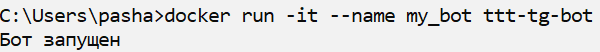
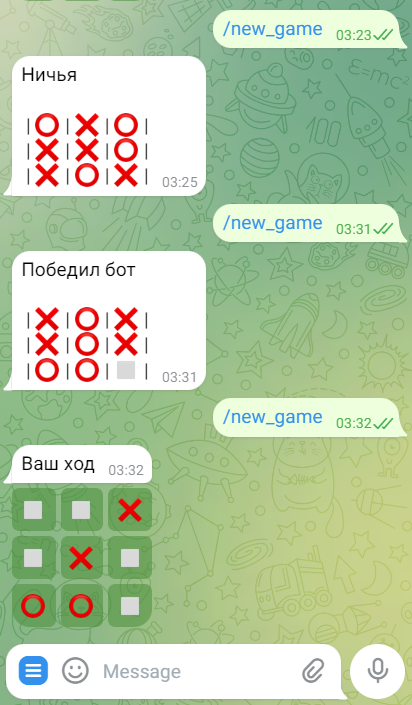
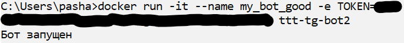
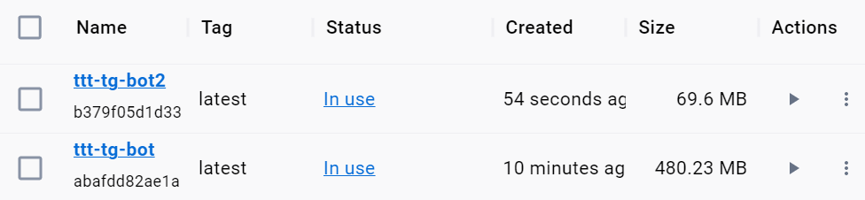

# Лабораторная работа №1
«Плохой/хороший dockerfile»

### Команда
* Безкоровайный Павел • K34211
* Долматов Дмитрий • K34212
* Коряков Сергей • K34201
* Кубашин Илья • K34211

## Задание

Написать два Dockerfile – плохой и хороший. Плохой должен запускаться и работать корректно, но в нём должно быть не менее 3 “bad practices”. В хорошем Dockerfile они должны быть исправлены. В Readme описать все плохие практики из кода Dockerfile и почему они плохие, как они были исправлены в хорошем Dockerfile, а также две плохие практики по использованию этого контейнера.

## Что будем создавать

Чтобы сделать работу более интересной, было принято решение поднять контейнер для сделанного пару лет назад телеграм-бота для игры в [крестики-нолики](https://github.com/pashabezk/TicTacToeTgBot).

Особенностью данного бота является то, что ему не нужна база данных для хранения игр. Все данные он берёт прямо из сообщения.

Изначальные файлы бота помещены в папку `src_bad`. В папке `src_good` находится немного модифицированный скрипт. Что конкретно изменено - будет указано в отчёте ниже.

## Создание плохого dockerfile

Полный текст плохого докерфайла представлен ниже.

```Dockerfile
FROM ubuntu:latest

WORKDIR /src

# копирование исходного кода
COPY ./src_bad /src

# установка python
RUN apt-get update
RUN apt-get install -y python3 pip
RUN pip install --no-cache-dir -r /src/requirements.txt

# для работы бота необходим токен указанный в файле token.txt
RUN touch /src/token.txt
RUN echo -n 'abcd_your_token' >> /src/token.txt

# запуск бота
CMD ["python3", "/src/main.py"]
```

### Демонстрация работы

Чтобы собрать образ использовалась команда:

`docker build -t ttt-tg-bot .`

Чтоб создать и запустить контейнер на основе образа:

`docker run -it --name my_bot ttt-tg-bot`

После успешного запуска в консоль будет выведено сообщение, что бот запущен



В телеграмм чате бот начнёт реагировать на команды



#### Bad practice №1

Использовать тег latest при импорте базового образа.

`FROM ubuntu:latest`

Это плохая практика, т.к. на момент сборки latest версия может измениться, и мы получим разные исходные контейнеры в разное время.
Это плохо, потому что могут обновиться важные зависимости и собранный контейнер может работать не так, как ожидалось.

#### Bad practice №2

Использование нескольких RUN вместо одного.

```Dockerfile
RUN apt-get update
RUN apt-get install -y python3 pip
RUN pip install --no-cache-dir -r /src/requirements.txt

RUN touch /src/token.txt
RUN echo -n 'abcd_your_token' >> /src/token.txt
```

Это плохая практика, т.к.  каждый RUN создаёт новый слой контейнера, а каждый слой контейнера - это лишние накладные расходы.
Лучше объединять команды `RUN` через двойной амперсанд `&&`, также удобно сносить их на новую строку.
Т.е. пример выше следовало бы написать так:

```Dockerfile
RUN apt-get update && \
    apt-get install -y python3 pip && \
    pip install --no-cache-dir -r /src/requirements.txt && \
    echo -n 'abcd_your_token' >> /src/token.txt
```

> Команду `touch` можно опустить, т.к. echo и так создаст файл, если он не существует

#### Bad practice №3

Записывать _чувствительные_ данные в образ контейнера (например логины, пароли, *токены*).

`RUN echo -n 'abcd_your_token' >> /src/token.txt`

> Следует отметить, что из соображений безопасности конкретный токен был скрыт.
> Для получения собственного токена для собственного бота - следуйте [инструкциям в readme файле](https://github.com/pashabezk/TicTacToeTgBot#%D1%83%D1%81%D1%82%D0%B0%D0%BD%D0%BE%D0%B2%D0%BA%D0%B0-%D0%B8-%D0%BD%D0%B0%D1%81%D1%82%D1%80%D0%BE%D0%B9%D0%BA%D0%B0) исходного репозитория.

Это плохая практика по двум причинам:
1. Прописывая токен в образе мы жёстко привязываем его к конкретному боту. Цель же данного образа дать возможность запустить _собственного_ бота в телеграмме.
2. Выкладывать контейнер с _чувствительной_ информацией в сеть небезопасно. Злоумышленники могут воспользоваться этим. В конкретно этом случае - могут начать писать от имени вашего бота, рассылая спам или запрещённый контент. В случае, если в образе контейнера будут учётные данные для авторизации например на сервере компании - это полный провал. Злоумышленник сможет украсть/повредить/слить конфиденциальную информации о компании и её клиентах, а может даже что-то похуже. В общем, нельзя указывать _чувствительную_ информацию в образе.

Данные для аутентификации лучше передать в виде переменных окружения.

## Создание хорошего dockerfile

Полный текст исправленного докерфайла представлен ниже.

```Dockerfile
FROM python:3.9.18-alpine3.17

LABEL type="telegram_bot" team="pashabezk, dimbikey, rendex85, kubachinIlya"

WORKDIR /src

COPY ./src_good /src

RUN pip install --no-cache-dir -r /src/requirements.txt

ENV TOKEN="DO_NOT_ADD_TOKEN_ON_DOCKERFILE"

CMD ["python3", "/src/main.py"]
```

### Демонстрация работы

Чтобы собрать образ использовалась команда:

`docker build -t ttt-tg-bot2 .`

Чтоб создать и запустить контейнер на основе образа:

`docker run -it --name my_bot_good -e TOKEN=abcd_your_token ttt-tg-bot2`

После успешного запуска в консоль будет выведено сообщение, что бот запущен



#### Bad practice №1

Тег latest был заменён на конкретную версию. Причем была выбрана компактная версия образа `python:3.9.18-alpine3.17`, что позволило уменьшить размер исходного образа.

#### Bad practice №2

Остался только один `RUN` в докерфайле. Причем благодаря использованию другого базового образа и замены принципа добавления токена отпала необходимость в нескольких командах. И теперь `RUN` выполняет только одну команду.

Исправление `Bad practice №1` и `Bad practice №2` позволило значительно уменьшить размер образа. Вместо `480.23Мб` получилось `69.6Мб`. Размер уменьшился в 6.8 раз.



#### Bad practice №3

Исходный скрипт требовал, чтобы токен для бота был записан в файл `token.txt`.
Т.к. токен следует все-таки передавать через переменные окружения, то файл `main.py` был изменён.
Если быть точнее, то была изменена функция поиска токена. Теперь она ищет токен не в файле, а в переменной окружения.

```python
def getToken():
    token = os.environ['TOKEN']
    return token
```

В докерфайле была создана переменная окружения и на всякий случай переменная имеет значение - не вводить токен внутри образа.

`ENV TOKEN="DO_NOT_ADD_TOKEN_ON_DOCKERFILE"`

## Плохие практики по использованию контейнеров

1. Плохой практикой считается создавать контейнеры не давай им имени. Имя можно задать с помощью флага `--name container_name`. Если имя не задать вручную, то оно будет сгенерировано автоматически. В огромной куче контейнеров с автоматически сгенерированными именами будет легко запутаться.
2. Пытаться упростить себе жизнь, каким-нибудь образом всё же добавив токен для телеграмма (или другие секретные данные) в образ докера. Например можно на основе образа, созданного с помощью хорошего докерфайла создать ещё один образ, в который захардкодить токен. Это будет плохой практикой, т.к. конфигурационные и секретные данные должны соединяться с контейнером на этапе его сборки.
3. Запускать контейнер в привилегированном режиме, когда этого не требуется. Для запуска контенера в привилегированном режиме используется флаг `--privileged`. Это плохо, т.к. такой контейнер получит доступ к хосту, чем могут воспользоваться злоумышленники.

## Вывод
В ходе выполнения лабораторной работы был создан докер-образ для развёртывания телеграмм чат-бота для игры в крестики нолики.
Были рассмотрены плохие практики по созданию образов и контейнеров, и в ходе лабораторной работы удалось выявить такие плохие практики при создании докерфайла и исправить их
