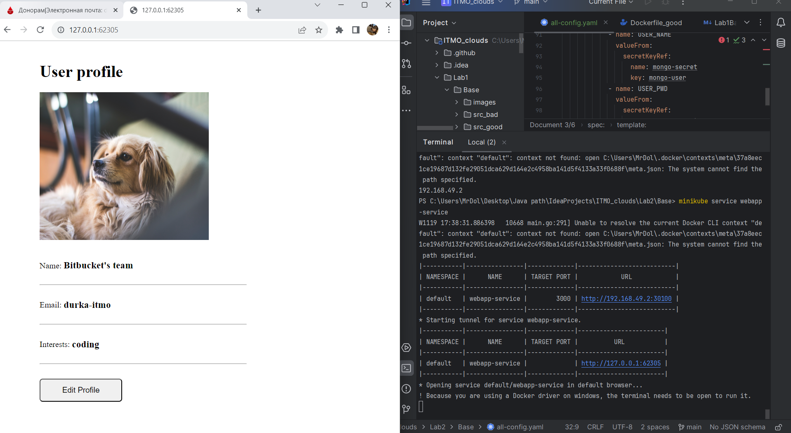

# Лабораторная работа №2
«Кубернетес с собачкой без ошейника»

### Команда
* Безкоровайный Павел • K34211
* Долматов Дмитрий • K34212
* Коряков Сергей • K34201
* Кубашин Илья • K34211

## Задание

Развернуть кластер K8S с несколькими ресурсами без HTTPS.

## Ход работы

Первым делом установим minikube. Если коротко, это такой докер-контейнер, который позволяет создавать песочницу из K8S кластера.  

Более того, в нём можно создавать поднимать докер-контейнеры тоже (контейнер в контейнер. "Чтобы открыть матрешку - надо открыть матрешку").

Отличие в том, что в K8S минимальной единицей является pod (обёртка вокруг контейнера).

Наше приложение будет состоять из нескольких podoв внутри одной ноды. Кстати, распределяет ресурсы, выделенные на ноду - kubelet. Поскольку мы создаем одну ноду, чтобы не перегружать систему, то всю досталось одной ноде.

Kubectl установлен по умолчанию

### Проектирование конфигурации
Стоит упомянуть, что наша структура будет иметь следующий вид: в ConfigMap будет находиться url на БД, в секретах - зашифрованные логины и пароли от БД, а также 2 файла для деплоя и сервисов как БД, так и самого приложения

Писать одновременно в одном файле и деплой, и сервис - хорошая практика. Вдобавок, отметитим, что все конфигурационные части будут находиться в одном файле по требованию к работе.
Сервис отвечает за маршрутизацию запросов, деплой - за создание **blueprint**  - количества реплик данного pod.

Поскольку базы данных не рекомендуется реплицировать через K8S blueprint, то создадим лишь одну реплику-оригинал.

Проверим minikube ip, по которому в итоге будет подключаться (не по localhost, хотя он тоже работает)

Шифрование пароля через base64 представлено ниже.

Введем зашифрованный логин и пароль в секрет.

Далее, напишем скрипты для создания каждого конфигурационного элемента. Данные приложены ниже.

ConfigMap для БД:

Деплой для БД:

Сервис для БД:

Деплой для приложения (был взят образ с DockerHub как приложения, так и БД)

Сервис для приложения:

P.S. Как вы могли заметить, хорошей практикой является зеркалирование внутреннего и внешнего порта.
Более того, на NodePort, отвечающий за внешние соединения, должен быть в промежутке от 30000-32760.

## Оценим работу конфигурационного файла
Работает одна нода, что соответствует ожиданиям.

Описание сервиса приложение представлено ниже:

Полная конфигурация без учета ConfigMap и Secret представлено ниже:

Конфиг-мапа и секрет представлены ниже (они не показываются в общей конфигурации)

В итоге, после запуска работы нашего приложения, видим, что оно работает:

## Вывод
В ходе выполнения лабораторной работы был создан кластер на одной ноде K8S для развёртывания node.js с mongodb приложения, находящего в общем network
Более того, реплик БД - 1 для обеспечения констистентности данных внутри ноды.