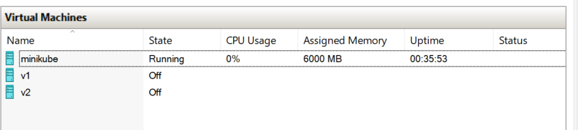
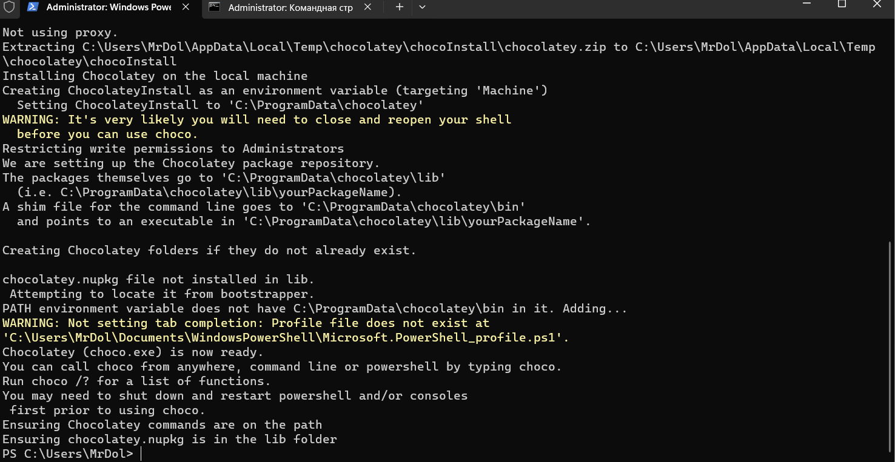

# Лабораторная работа №2
«Кубернетес с собачкой с ошейником»

### Команда
* Безкоровайный Павел • K34211
* Долматов Дмитрий • K34212
* Коряков Сергей • K34201
* Кубашин Илья • K34211

## Задание

Развернуть кластер K8S с несколькими ресурсами с HTTPS.

## Ход работы
Поскольку развернуть HTTPS на драйвере Docker в виде контейнера не представляется возможным на Windows 11, то было принято решение создать образ ВМ через Hyper-V Manager.

Образ:




Далее, был установлен установщик пакетов Chocolatey



Через Chocolatey был установлен плагин, который позволяет создавать самоподписанные (self-signed) сертификаты


Успешная установка показана ниже.


Для того, чтобы создать секрет - необходимо наличие приватного ключа и сертификата. Сделаем их


Далее, необходимо проверить сертификат


Заранее проверим FireWall на HTTPS соединение.


Необходимо добавить в /etc/hosts информацию по поводу DNS псевдо-домена трансляции адресов


Зачем нам это? Для того чтобы по названию переходить на ip адрес (не localhost).

Создадим секрет на основе приватного ключа и сертификата


После необходимо выполнить самую главную часть - добавление ingress в конфигурационный файл.
Он необходим, поскольку является первой структурой на пути к запросу, который распределяет их по services


```yaml
apiVersion: networking.k8s.io/v1
kind: Ingress
metadata:
  name: ingress-service
spec:
  tls:
    - hosts:
        - ingress.minikube
      secretName: my-service-tls
  rules:
    - host: ingress.minikube
      http:
        paths:
          - path: /
            pathType: Prefix
            backend:
              service:
                name: webapp-service
                port:
                  number: 3000
```

Укажем в ingress.minikube адрес, который соответствует записи в hosts, на адресе которого будет использоваться созданный нами секрет
Порт выставлен по порту webapp-service, который получает запрос.


При запросе по этому же адресу с использованием псевдо-доменного имени браузер жалуется на самоподписанный сертификат, который является нашим.


Самоподписанные сертификаты не являются доверенными центрами сертификации (Certificate Authorities - CAs). Браузеры обычно ожидают, что сертификаты будут подписаны доверенным CA, иначе они выдают предупреждение.

## Вывод
В ходе выполнения лабораторной работы был создан кластер на одной ноде K8S для развёртывания node.js с mongodb приложения, находящего в общем network.
Более того, мы можем создавать самоподписанные сертификаты, используя их как дополнительную защиту в случае несанкционированного подключения, однако на такие сертификаты жалуются браузеры, поэтому при деплое не стоит использовать неавторизованные сертификаты.