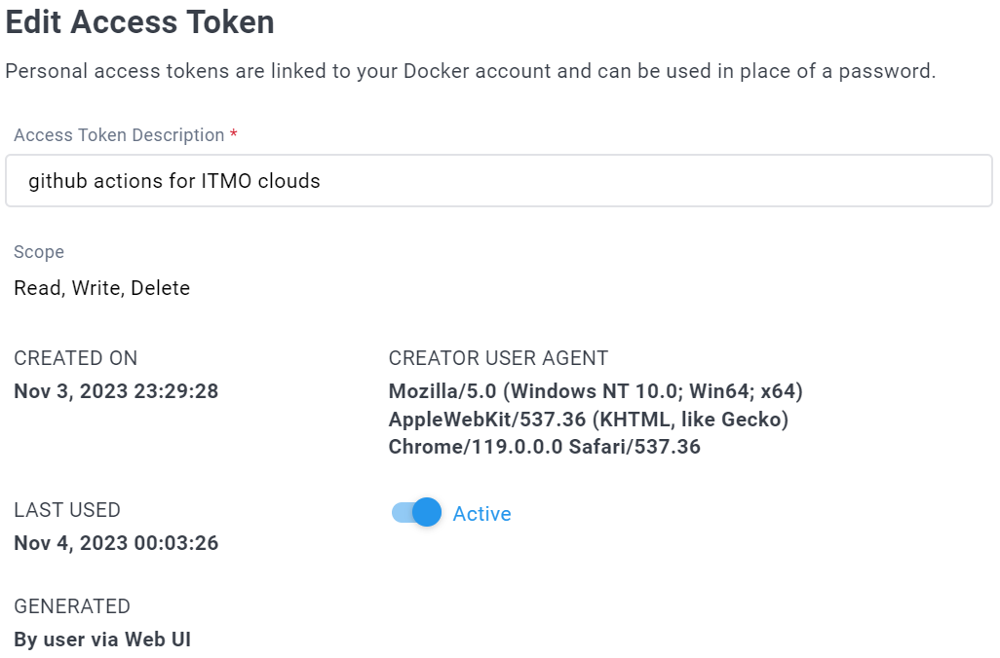
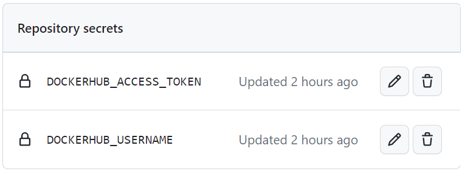

# Лабораторная работа №3
«Автоматическая сборка образа»

### Команда
* Безкоровайный Павел • K34211
* Долматов Дмитрий • K34212
* Коряков Сергей • K34201
* Кубашин Илья • K34211

## Задание
Сделать, чтобы после пуша в ваш репозиторий автоматически собирался докер образ и результат его сборки сохранялся куда-нибудь. (например, если результат - текстовый файлик, он должен автоматически сохраниться на локальную машину или ваш сервер).

## Настройка CI/CD
У GitHub есть возможность настройки CI/CD с помощью GitHub Actions. Им и воспользуемся.

Для настройки GitHub Actions необходимо создать `.yml` файл в директории `.github/workflows/`.

Ниже представлен текст созданного файла. Сам файл: [.github/workflows/lab3_ci_cd.yml](/.github/workflows/lab3_ci_cd.yml).

```yml
name: Auto publish docker image

# sets workflow auto run
on:
  push:
    branches: [ "main" ]
    paths: # action will run only if changes paths below
      - "Lab3/Base/**"
      - ".github/workflows/**"
  workflow_dispatch: # to allow run action via github interface

jobs:
  build_and_push: # job name
    runs-on: ubuntu-22.04

    defaults:
      run:
        working-directory: "/Lab3/Base"

    steps:
      - name: Checkout repository
        uses: actions/checkout@v3

      - name: Login to Docker Hub
        uses: docker/login-action@v1
        with:
          username: ${{ secrets.DOCKERHUB_USERNAME }}
          password: ${{ secrets.DOCKERHUB_ACCESS_TOKEN }}

      - name: Build and push to Docker hub
        uses: docker/build-push-action@v2
        with:
          context: ./Lab3/Base/
          push: true
          tags: pashabezk/tic-tac-toe-tg-bot:${{ github.run_number }} , pashabezk/tic-tac-toe-tg-bot:latest
```

Разберём файл более подробно.

### Настройка имени и правил запуска

С помощью `name` укажем название сценария. Это название будет отображаться в разделе Actions.

С помощью `on` прописываются правила для запуска сценария.
В нашем случае будет два правила:
1. Правило на автозапуск после push в ветку `main`. Причём дополнительно пропишем, что сценарий надо запускать только если изменились файлы в директории третьей лабораторной работы или директории с настройками workflow.
2. С помощью `workflow_dispatch` добавим возможность запускать сценарий через интерфейс github.

```yml
name: Auto publish docker image

# sets workflow auto run
on:
  push:
    branches: [ "main" ]
    paths: # action will run only if changes paths below
      - "Lab3/Base/**"
      - ".github/workflows/**"
  workflow_dispatch: # to allow run action via github interface
```

На рисунке ниже представлен раздел actions в репозитории

> add photo

### Настройка задачи

Добавим задачу с помощью ключевого слова `jobs`. Дадим ей название `build_and_push`. Укажем, что запускать задачу надо на `ubuntu-22.04` _(это последняя версия Ubuntu, доступная для GitHub Actions, ознакомиться с полным списком ОС можно по [ссылке](https://github.com/actions/runner-images/))_.

Также укажем директорию по умолчанию с помощью `defaults → run → working-directory`.

В пункте `steps` описываются шаги выполнения задачи.

```yml
jobs:
  build_and_push: # job name
    runs-on: ubuntu-22.04

    defaults:
      run:
        working-directory: "/Lab3/Base"

    steps: # ...
```

### Описание шагов
> Используемые ключевые слова:
> * в `name` указывается имя, отображаемое во время выполнения сценария;
> * в `uses` указывается имя какого-то уже написанного сценария;
> * `with` позволяет передать параметры в вызываемый сценарий.


#### 1. Проверка репозитория

[Checkout](https://github.com/marketplace/actions/checkout) извлекает репозиторий, благодаря этому остальная часть сценария получает к нему доступ.

```yml
- name: Checkout repository
  uses: actions/checkout@v3
```

#### 2. Авторизация в DockerHub

С помощью [docker/login-action](https://github.com/marketplace/actions/docker-login) авторизуемся на DockerHub. Для авторизации используются секреты, сохранённые в GitHub Secrets.

`DOCKERHUB_USERNAME` - логин пользователя.

`DOCKERHUB_ACCESS_TOKEN` - токен для авторизации.

Чтобы получить токен для авторизации, необходимо зайти в свой профиль на DockerHub, в настройки, в раздел [Security](https://hub.docker.com/settings/security).

Чтобы настроить секреты в GitHub, необходимо перейти в нужный репозиторий, в настройки, в разделе `Security` раскрыть `Secrets and variables` и выбрать `Actions`.

```yml
- name: Login to Docker Hub
  uses: docker/login-action@v1
  with:
    username: ${{ secrets.DOCKERHUB_USERNAME }}
    password: ${{ secrets.DOCKERHUB_ACCESS_TOKEN }}
```

На фото ниже информация о созданном токене в DockerHub.



На фото ниже - созданные в репозитории секреты.



#### 3. Создание и загрузка образа в DockerHub

С помощью [docker/build-push-action](https://github.com/marketplace/actions/build-and-push-docker-images) собираем образ и отправляем его в DockerHub.

Параметр `context` позволяет указать папку, гже будет лежать dockerfile и необходимые файлы.

Параметр `push: true` говорит о том, что собранный образ нужно отправить в DockerHub.

Параметр `tags` позволяет указать название репозитория в DockerHub, а также версию. В данном случае при сборке ставится два тега: `latest` и с помощью `${{ github.run_number }}` указывается номер версии (версия будет такой же, какой и номер запущенного action).

```yml
- name: Build and push to Docker hub
  uses: docker/build-push-action@v2
  with:
    context: ./Lab3/Base/
    push: true
    tags: pashabezk/tic-tac-toe-tg-bot:${{ github.run_number }} , pashabezk/tic-tac-toe-tg-bot:latest
```

## Вывод
Текст выводы
