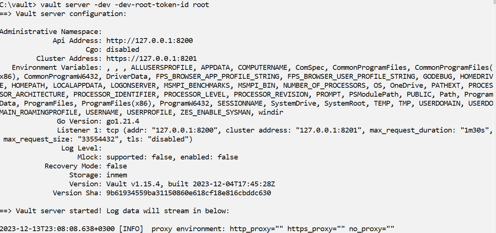
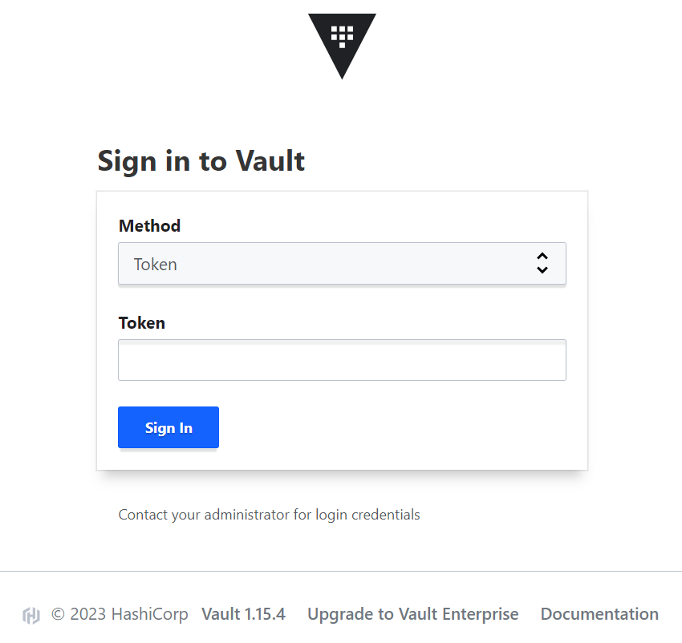
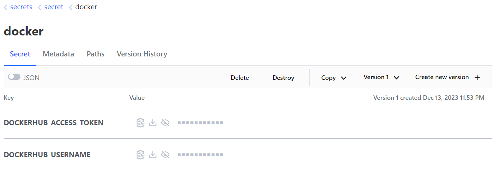
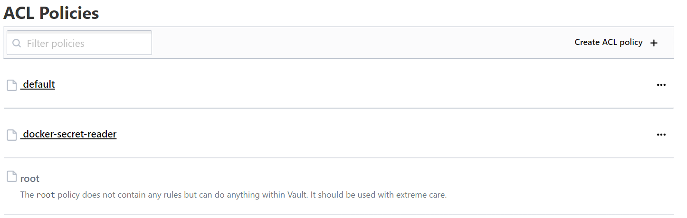
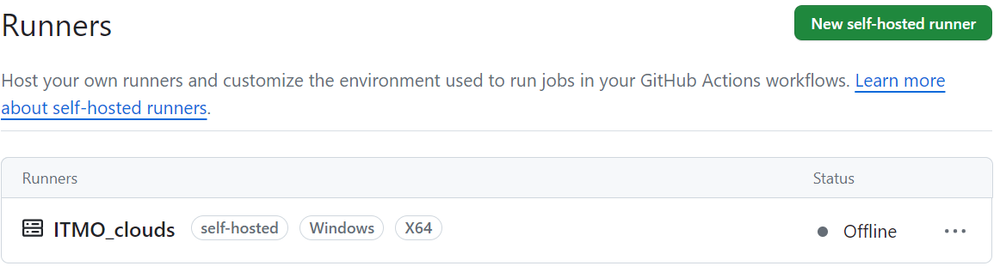
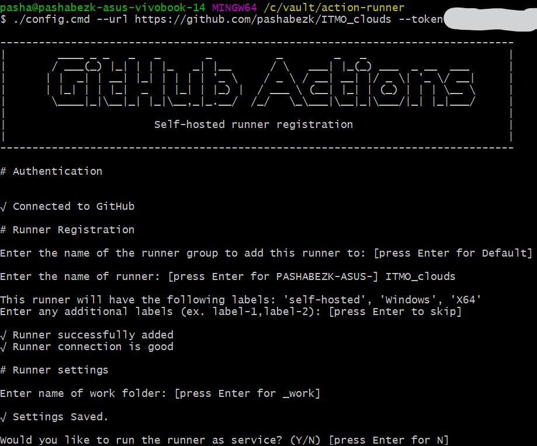
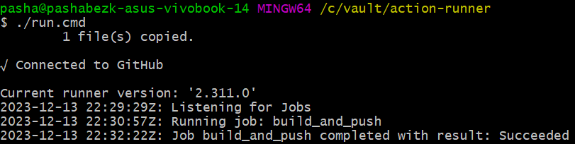
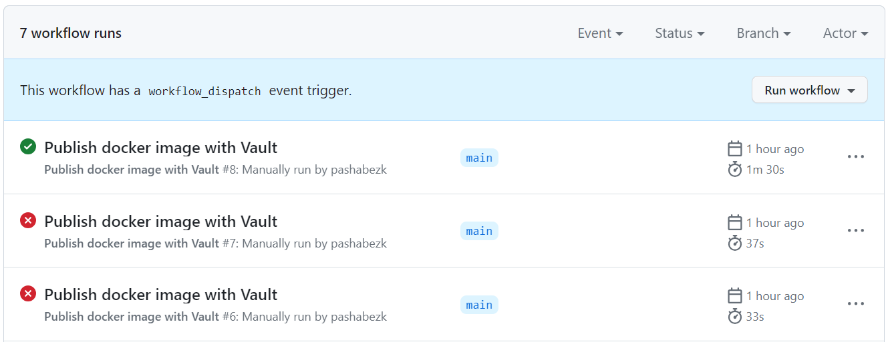

# Лабораторная работа №3*
«Автоматическая сборка образа с настройкой секретов»

### Команда
* Безкоровайный Павел • K34211
* Долматов Дмитрий • K34212
* Коряков Сергей • K34201
* Кубашин Илья • K34211

## Задание
Сделать красиво работу с секретами. Например, поднять Hashicorp Vault и сделать так, чтобы ci/cd пайплайн ходил туда, брал секрет, использовал его не светя в логах.

## Настройка HashiCorp Vault
Для хранения секретов было решено использовать [HashiCorp Vault](https://www.vaultproject.io/).

> При выполнении работы очень помогла статья из документации:<br/>
> https://developer.hashicorp.com/vault/tutorials/app-integration/github-actions

Скачать бинарник для Vault можно по ссылке: https://developer.hashicorp.com/vault/install.

### Запуск локального Vault сервера

Для запуска сервера используем команду:

```bat
vault server -dev -dev-root-token-id root
```



Помимо консольной работы, можно взаимодействовать с Vault через графический интерфейс. Для этого нужно открыть запущенный веб-сервер: `http://127.0.0.1:8200/`. Для входа используем токен `root`, указанный во время запуска Vault сервера.



> Автор данного отчёта понимает, что нельзя использовать в production _небезопасные_ токены, но в целях изучения Vault был указан стандартный токен `root`

### Создание секретов

Откроем второй терминал. В силу специфики команд был использован bash терминал.

> Также для работы потребовалось скачать `jq` пакет для Windows. [Скачать jq](https://github.com/jqlang/jq/releases/tag/jq-1.7.1).

Используя команды ниже в Vault были добавлены необходимые секреты, настроена политика безопасности для чтения секретов и получен токен для этой политики.

```sh
# set env vars
export VAULT_ADDR=http://127.0.0.1:8200
export VAULT_TOKEN=root

# save secrets
/c/vault/vault kv put secret/docker DOCKERHUB_USERNAME=pashabezk DOCKERHUB_ACCESS_TOKEN=add_your_token_here

# create policy to read secret
/c/vault/vault policy write docker-secret-reader - <<EOF
path "secret/data/docker" {
    capabilities = ["read"]
}
EOF

# create env var with policy token
GITHUB_REPO_TOKEN=$(/c/vault/vault token create -policy=docker-secret-reader -format json | /c/vault/jq -r ".auth.client_token")

# test: getting token via policy token
VAULT_TOKEN=$GITHUB_REPO_TOKEN /c/vault/vault kv get secret/docker
```

Также на этом шаге необходимо добавить секрет в GitHub secrets.
Создадим секрет под названием `VAULT_TOKEN` значением которого будет значение переменной `GITHUB_REPO_TOKEN`.

> Чтоб получить значение переменной:
> ```sh
> echo $GITHUB_REPO_TOKEN
> ```

Убедиться, что секреты и политика созданы успешно можно через веб-интерфейс Vault.





### Создание self-hosted runner

Так как используется локальный Vault сервер, то GH actions необходимо тоже запускать локально. Для этого был создан и настроен self-hosted runner.



Вот так выглядит настройка конфигурации раннера локально



### Настройка workflow

Ниже представлена модификация workflow-файла для работы с Vault. Сам файл: [.github/workflows/lab3_pro_ci_cd.yml](/.github/workflows/lab3_pro_ci_cd.yml).

```yml
name: Publish docker image with Vault

# sets workflow run properties
on:
  workflow_dispatch: # to allow run action via github interface

jobs:
  build_and_push: # job name
    runs-on: self-hosted

    defaults:
      run:
        working-directory: "/Lab3/Base"

    steps:
      - name: Checkout repository
        uses: actions/checkout@v4

      - name: Import Secrets
        uses: hashicorp/vault-action@v2.4.0
        with:
          url: http://127.0.0.1:8200
          tlsSkipVerify: true
          token: ${{ secrets.VAULT_TOKEN }}
          secrets: |
            secret/data/docker DOCKERHUB_USERNAME ;
            secret/data/docker DOCKERHUB_ACCESS_TOKEN

      - name: Login to Docker Hub
        uses: docker/login-action@v3
        with:
          username: ${{ env.DOCKERHUB_USERNAME }}
          password: ${{ env.DOCKERHUB_ACCESS_TOKEN }}

      - name: Build and push to Docker hub
        uses: docker/build-push-action@v5
        with:
          context: ./Lab3/Base/
          push: true
          tags: pashabezk/tic-tac-toe-tg-bot:${{ github.run_number }} , pashabezk/tic-tac-toe-tg-bot:latest
```

Рассмотрим изменения более детально.

#### Запуск только по кнопке

В триггерах action был оставлен только ручной запуск, так как для работы этого action нужно, чтобы был локально запущен vault.

#### Импорт секретов

[Vault-action](https://github.com/marketplace/actions/hashicorp-vault) используется для импорта секретов в виде переменных среды.
1. Указываем url, на котором запущен Vault: `http://127.0.0.1:8200`.
2. Указываем токен, сохранённый в GH secrets `secrets.VAULT_TOKEN`.
3. Указываем, что необходимо импортировать секреты `DOCKERHUB_USERNAME` и `DOCKERHUB_ACCESS_TOKEN`.

```yml
- name: Import Secrets
  uses: hashicorp/vault-action@v2.4.0
  with:
    url: http://127.0.0.1:8200
    tlsSkipVerify: true
    token: ${{ secrets.VAULT_TOKEN }}
    secrets: |
      secret/data/docker DOCKERHUB_USERNAME ;
      secret/data/docker DOCKERHUB_ACCESS_TOKEN
```

#### Авторизация в DockerHub

Скорректируем авторизацию в DockerHub. Теперь секреты берём не из GH Secrets, а из переменных среды, куда они были помещены на предыдущем шаге.

```yml
- name: Login to Docker Hub
  uses: docker/login-action@v3
  with:
    username: ${{ env.DOCKERHUB_USERNAME }}
    password: ${{ env.DOCKERHUB_ACCESS_TOKEN }}
```

### Запуск workflow

Для начала необходимо запустить раннер локально. Он будет ждать, пока GH обратится к нему.
На рисунке ниже показан запущенный раннер с успешным завершением workflow.



С помощью кнопки в GitHub Actions можно запустить workflow.
На рисунке ниже видно, что после правильной настройки yml-файла workflow успешно отработал.



## Заключение
С помощью [HashiCorp Vault](https://www.vaultproject.io/) и self-hosted runner было настроено безопасное использование секретов в GitHub Actions
