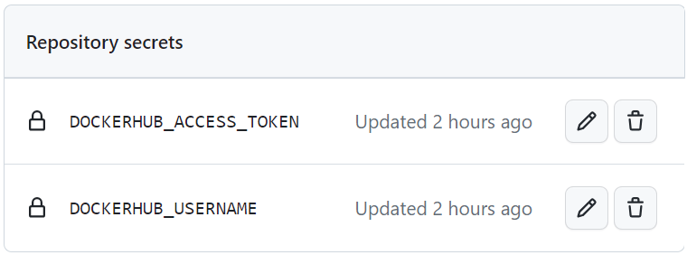

# Лабораторная работа №3*
«Автоматическая сборка образа с настройкой секретов»

### Команда
* Безкоровайный Павел • K34211
* Долматов Дмитрий • K34212
* Коряков Сергей • K34201
* Кубашин Илья • K34211

## Задание
Сделать красиво работу с секретами. Например, поднять Hashicorp Vault и сделать так, чтобы ci/cd пайплайн ходил туда, брал секрет, использовал
его не светя в логах.

## Настройка секретов
Так как для выполнения работы было выбрано средство GitHub Actions, то было решено использовать нативную поддержку секретов для GitHub - GitHub Secrets.

Чтобы настроить секреты в GitHub, необходимо перейти в нужный репозиторий, в настройки, в разделе `Security` раскрыть `Secrets and variables` и выбрать `Actions`.

На фото ниже - созданные в репозитории секреты.



Значение GitHub секрета нельзя посмотреть. Можно только изменить или удалить.

Для использования в сценариях (actions) необходимо использовать следующую конструкцию ` ${{ secrets.SECRET_NAME }}`.

Использование секретов в сценарии:

```yml
- name: Login to Docker Hub
  uses: docker/login-action@v3
  with:
    username: ${{ secrets.DOCKERHUB_USERNAME }}
    password: ${{ secrets.DOCKERHUB_ACCESS_TOKEN }}
```

Проверим, что секреты не светятся в логах. Для этого зайдем в выполненный workflow и раскроем шаг с авторизацией.

Как можно увидеть на рисунке ниже - секреты не раскрываются.


## Вывод
С помощью GitHub Secrets было настроено хранение и безопасное использование секретов - данных для авторизации на DockerHub
