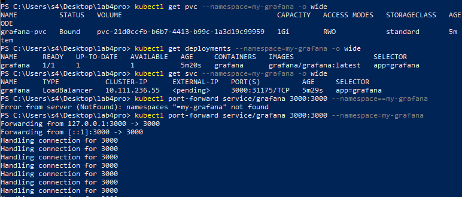
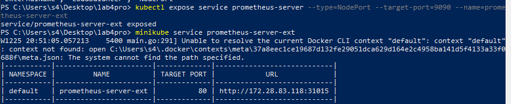
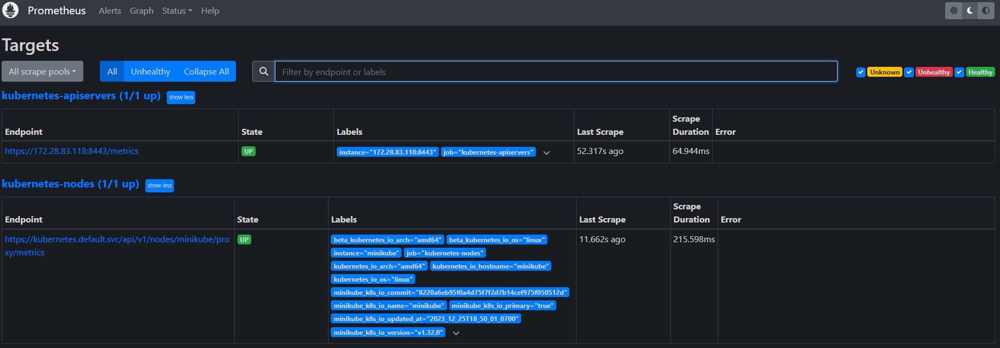
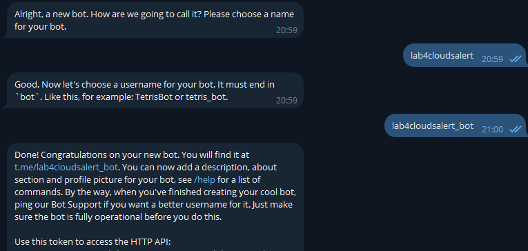
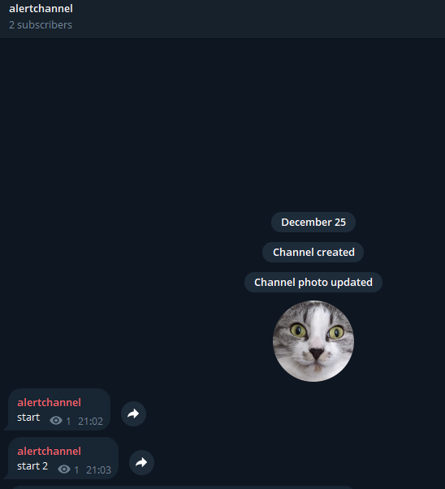
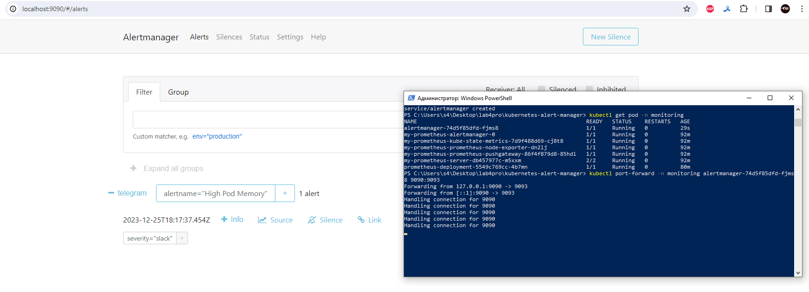
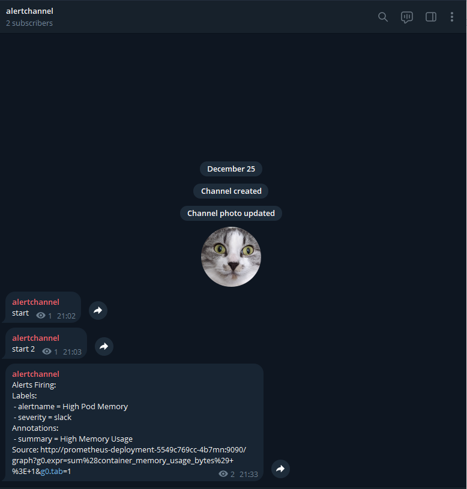

# Четвертая со звездочкой
«Настройка алерта кодом»

### Команда
* Безкоровайный Павел • K34211
* Долматов Дмитрий • K34212
* Коряков Сергей • K34201
* Кубашин Илья • K34211

## Задание
Настроить алерт кодом (не в интерфейсе графаны:), показать пример его срабатывания. Попробовать сделать так, чтобы он приходил, например, на почту или в телеграм. Если не получится - показать имеющийся результат и аргументировать, почему дальше невозможно реализовать.

> Важная информация: судя по времени пуша, можно заметить что с выполнением 4* пошло что-то не так, поэтому я как исполнитель (Коряков С.А.) беру ответсвенность за плагиат на себя и честно прикрепляю ссылки теми ресурсами (гитами одногруппников) которыми пользовался:
>
> [Команда 9 🐣](https://github.com/LenaSpevak/2023-2024_DevOps_Kostenko_Spevak_Guseynov/blob/main/lab4/lab4star_report.md) - взял ссылку на чудесный гит с настроенным алертом
>
> [Непримерные непримеры](https://github.com/IVladimirA/itmo-cloud-systems-and-services/tree/master/lab-4) - взял частично настройку прометеуса

## Запуск всего-всего
Поднимаю миникуб, графану (описано в 4ой лабе):
```bat
minikube start --vm-driver=hyperv
kubectl create -f .\all-config.yaml
minikube service webapp-service
kubectl create namespace my-grafana
kubectl apply -f .\grafana.yaml --namespace=my-grafana
kubectl port-forward service/grafana 3000:3000 --namespace==my-grafana
```

Поднимаю прометеус как сервис через НодПорт:

```bat
kubectl expose service prometheus-server --type=NodePort --target-port=9090 --name=prometheus-server-ext
minikube service prometheus-server-ext
```



Как оно выглядит:



## Алертменеджер
Для алертов был создан бот + канал в тг, куда все алерты будут прилетать:





был скопирован репозиторий с базовой настройкой готового алертменеджера:
```cmd
git clone https://github.com/bibinwilson/kubernetes-alert-manager.git
```
Единственный конфигурируемый файл - **[/AlertManagerConfigmap.yaml](./kubernetes-alert-manager/AlertManagerConfigmap.yaml)** в нем были указаны данные канала и токен бота (бот вместе с токеном уже удален, не было времени настраивать секреты и переменные окружения)

Были созданы объекты кластера в подтянутом репозитории с помощью этих команд:
```bat
kubectl create -f .\AlertManagerConfigmap.yaml
configmap/alertmanager-config created
kubectl create -f .\AlertTemplateConfigMap.yaml
configmap/alertmanager-templates created
kubectl create -f .\Deployment.yaml
deployment.apps/alertmanager created
kubectl create -f .\Service.yaml
service/alertmanager created
```

Была найдена нужная пода и запущен алерт-менеджер:
```bat
kubectl get pod -n monitoring
kubectl port-forward -n monitoring alertmanager-74d5f85dfd-fjms8 9090:9093
```



В телеграмм сразу же пришло типовое сообщение:


https://t.me/alerlab4prochannel

## Вместо финала
Извиняюсь и за качество отчета и за качество лабы, буквально из-за форс-мажора пришлось делать работу на коленке в последние часы перед сдачей. Надеюсь при проверке лабы читающий это расчувствуется аватаркой канала для алертов (это кошка моего хорошего приятеля) и войдет в мое положение. С наступающим!
